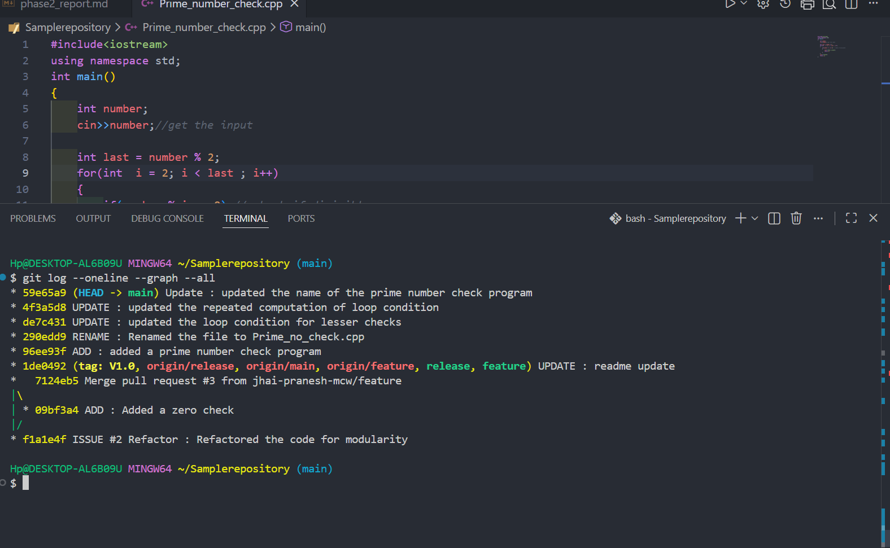
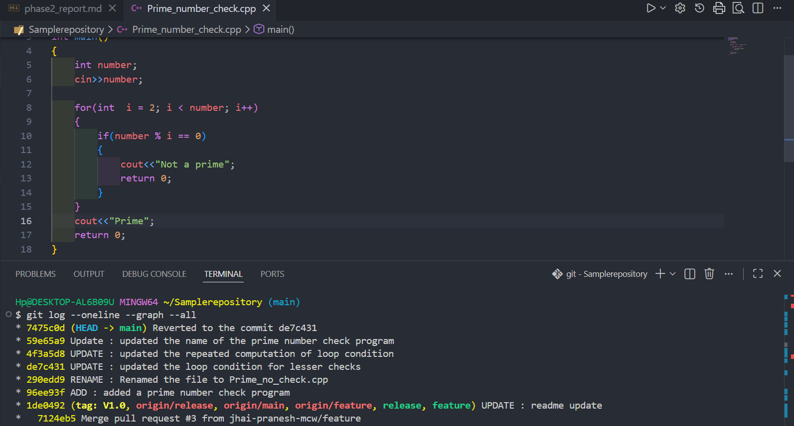
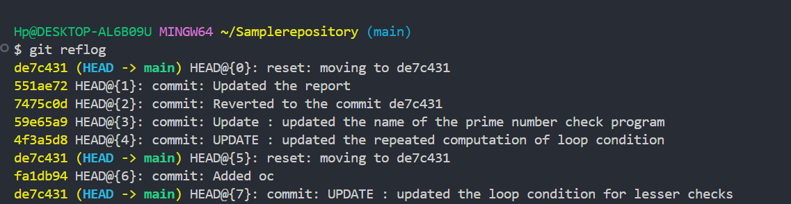
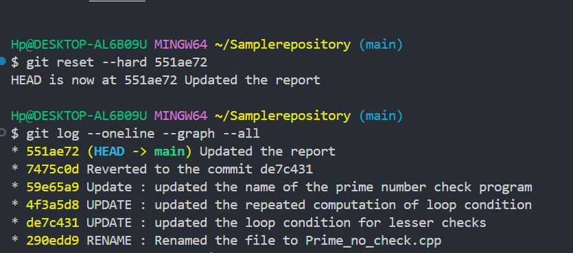
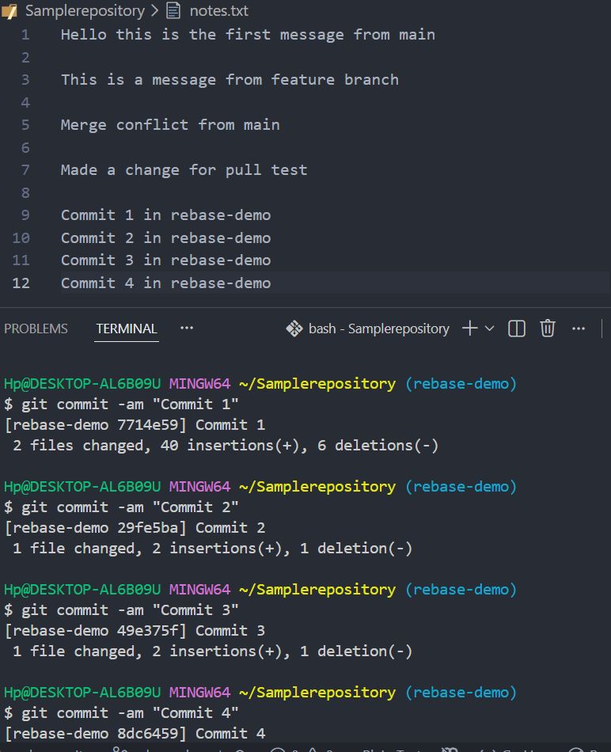
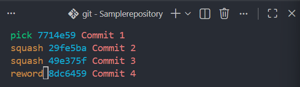
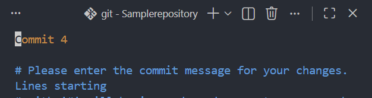
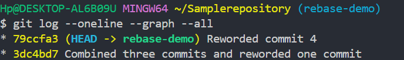
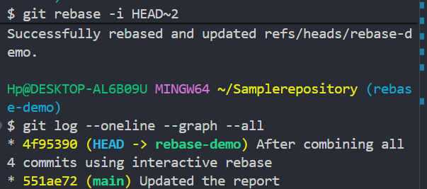

# Phase 2 Report

## git revert

### Before revert 



### After revert




### **Q : Which commit was reverted?**
 Commit `4f3a5d8` (bad commit) was reverted to `de7c431`(good commit) 
 using 
 ```bash
 git revert de7c431
 ```
 and made into revert commit `7475c0d`(new commit created through git revert)

 ### **Q : What changed?**
 In the program when `4f3a5d8` commit happened i added a variable called `int last = number%2` to solve the repeated computation of the condition `i < number/2` in
 the loop. I accidently used `%` instead of `/` hence the problem occured. I noticed that it wasa logic error and hence reverted to the commit that was last working fine and conflict happened at that exact line since we are not using `git reset` changes were still there , hence i used only the incoming changes and made it error free.

 ### **Q : Why revert is safer than reset?**
When we  use revert, the history of the branch is not discarded and we can use it for debugging. But when we use reset instead of revert, the commit history of the error commits are discarded. 

## git reflog

### reflog history : 

>The HEAD got reset after a `git reset --hard de7c431` 



Using the history of the reflog we manged to reset it again using the commit `551ae72` by 

```bash
git reset --hard 551ae72
```
and the tree became



### **Q:What is difference between git reflog and git log?**
`git reflog` is different from `git log` because git log only shows the commit history that can be reached from the branch or if `--all` is mentioned, then it shows all commits that are reachable from every branch, but git reflog
shows the history of all the reference movements like HEAD or branch ref , including the commits that are no longer reachable.

## git rebase interactive squash

Creating a rebase-demo branch
```bash
git switch -c rebase-demo
```

### Four commits :


### Interactive rebase



### reword



### after rewording the 4th commit



### after squashing all four commits



## git cherry-pick

Creating the branches
```bash
git switch -c feature-a
git switch main
git switch -c feature-b
```
switch to feature-a
```bash
git switch feature-a
```
Create two commits:
```bash
Hp@DESKTOP-AL6B09U MINGW64 ~/Samplerepository (feature-a)
$ git commit -am "Commit 1"
[feature-a 52500d9] Commit 1
 1 file changed, 3 insertions(+), 1 deletion(-)

Hp@DESKTOP-AL6B09U MINGW64 ~/Samplerepository (feature-a)
$ git commit -am "Commit 2"
[feature-a 87baf1d] Commit 2
 1 file changed, 2 insertions(+), 1 deletion(-)
 ```

switch to feature-b
```bash
git switch feature-b
```

cherry pick the first commit from feature-1 
```bash
Hp@DESKTOP-AL6B09U MINGW64 ~/Samplerepository (feature-b)
$ git cherry-pick 52500d9
[feature-b b175b7a] Commit 1
 Date: Thu Aug 6 22:43:36 2026 +0530
 1 file changed, 3 insertions(+), 1 deletion(-)
```
After cherry-pick the log is 

```bash
Hp@DESKTOP-AL6B09U MINGW64 ~/Samplerepository (feature-b)
$ git log --oneline
b175b7a (HEAD -> feature-b) Commit 1
```

### **Q: Why cherry-pick was used?**
Cherry -pick is to be used when we only need a specific commit not the entire branch. Here we used cherry-pick to pick pick only the commit 1 from feature-a and created another commit in feature-b.

## Cleanup

Before deleting the branches
```bash
Hp@DESKTOP-AL6B09U MINGW64 ~/Samplerepository (main)
$ git branch
  bug_fix
  feature
  feature-a
  feature-b
* main
  rebase-demo
  release
```

Deleted using 
```bash
$ git branch -d bug_fix feature-a feature-b rebase-demo
```

After deleting
```bash
$ git branch
  feature
* main
  release
```